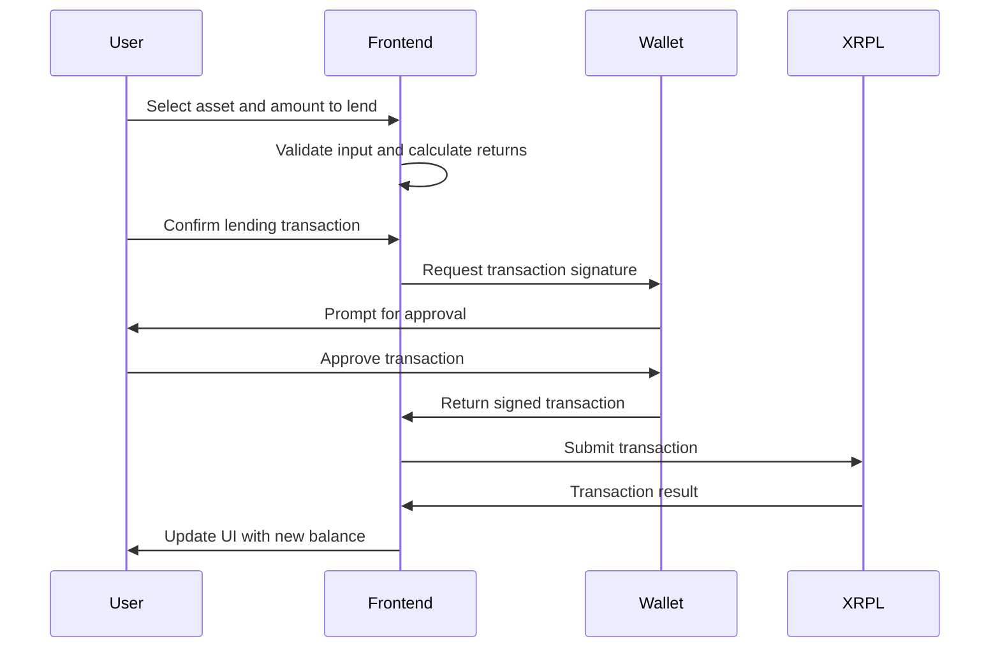
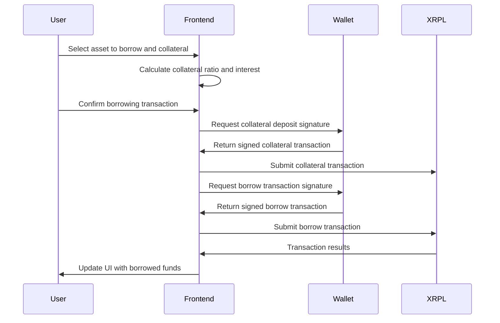

# xOcean XRPL DeFi Lending Protocol - Technical Design Document

## 1. Overview

xOcean is a decentralized finance (DeFi) lending protocol built on the XRP Ledger (XRPL) that enables users to lend and borrow digital assets in a trustless, automated manner. The protocol leverages XRPL's native features including trustlines, escrows, and automated market makers (AMM) to create a secure and efficient lending ecosystem.

## 2. Architecture Overview

### 2.1 High-Level Architecture

```
┌─────────────────┐    ┌─────────────────┐    ┌─────────────────┐
│   Frontend UI   │    │  Wallet Layer   │    │   XRPL Network  │
│   (React/Vite)  │◄──►│   (Adapters)    │◄──►│   (Blockchain)  │
└─────────────────┘    └─────────────────┘    └─────────────────┘
         │                       │                       │
         ▼                       ▼                       ▼
┌─────────────────┐    ┌─────────────────┐    ┌─────────────────┐
│  State Management│    │ Transaction     │    │  Smart Contracts│
│  (React Context)│    │ Builders        │    │  (Hooks/Escrows)│
└─────────────────┘    └─────────────────┘    └─────────────────┘
```

### 2.2 Core Components

1. **Frontend Application**: React-based user interface
2. **Wallet Integration Layer**: Multi-wallet support with adapter pattern
3. **XRPL Service Layer**: Transaction building and blockchain interaction
4. **State Management**: Context-based application state
5. **Smart Contract Logic**: XRPL hooks and escrow mechanisms

## 3. Frontend Architecture

### 3.1 Technology Stack

- **Framework**: React 18 with TypeScript
- **Build Tool**: Vite
- **Styling**: Tailwind CSS
- **State Management**: React Context API
- **XRPL Integration**: xrpl.js library
- **Wallet Support**: Multiple wallet adapters

### 3.2 Project Structure

```
src/
├── components/          # Reusable UI components
│   ├── ui/             # Base UI components
│   ├── ConnectWalletButton.tsx
│   └── NetworkBadge.tsx
├── pages/              # Main application pages
│   ├── Home.tsx        # Dashboard and overview
│   ├── Lend.tsx        # Lending interface
│   └── Borrow.tsx      # Borrowing interface
├── context/            # React context providers
│   └── WalletProvider.tsx
├── hooks/              # Custom React hooks
│   ├── useXRPL.ts      # XRPL connection hook
│   ├── useBalance.ts   # Balance management
│   └── useTrustline.ts # Trustline operations
├── services/           # Business logic services
│   └── txBuilders.ts   # Transaction builders
├── wallets/            # Wallet integration
│   ├── adapters/       # Wallet-specific adapters
│   ├── types.ts        # Wallet type definitions
│   └── index.ts        # Wallet registry
├── config/             # Configuration files
│   ├── networks.ts     # Network configurations
│   └── env.ts          # Environment variables
└── types/              # TypeScript type definitions
    └── global.d.ts
```

### 3.3 Component Architecture

#### 3.3.1 Wallet Provider Pattern

```typescript
interface WalletContextType {
  wallet: Wallet | null;
  isConnected: boolean;
  connect: (walletType: WalletType) => Promise<void>;
  disconnect: () => void;
  signTransaction: (tx: Transaction) => Promise<string>;
}
```

#### 3.3.2 Adapter Pattern for Wallets

```typescript
interface WalletAdapter {
  name: string;
  icon: string;
  connect(): Promise<WalletConnection>;
  disconnect(): void;
  signTransaction(tx: Transaction): Promise<string>;
  getAddress(): string;
}
```

## 4. XRPL Integration

### 4.1 Core XRPL Features Used

1. **Trustlines**: For token support and credit relationships
2. **Escrows**: For time-locked lending agreements
3. **Hooks**: For automated lending logic (future implementation)
4. **AMM**: For liquidity and price discovery
5. **Multi-signing**: For enhanced security

### 4.2 Transaction Types

#### 4.2.1 Lending Transactions

```typescript
interface LendingTransaction {
  type: 'EscrowCreate';
  account: string;
  destination: string;
  amount: Amount;
  finishAfter: number;
  condition?: string;
  fulfillment?: string;
}
```

#### 4.2.2 Borrowing Transactions

```typescript
interface BorrowingTransaction {
  type: 'EscrowFinish';
  account: string;
  owner: string;
  offerSequence: number;
  condition?: string;
  fulfillment?: string;
}
```

### 4.3 Smart Contract Logic

#### 4.3.1 Lending Pool Management

```typescript
class LendingPool {
  private poolId: string;
  private asset: Currency;
  private totalSupply: Amount;
  private totalBorrowed: Amount;
  private interestRate: number;
  
  async deposit(amount: Amount): Promise<TransactionResult> {
    // Create escrow for lending
    // Update pool state
    // Issue pool tokens
  }
  
  async withdraw(poolTokens: Amount): Promise<TransactionResult> {
    // Burn pool tokens
    // Release escrowed funds
    // Update pool state
  }
  
  async borrow(amount: Amount, collateral: Amount): Promise<TransactionResult> {
    // Validate collateral ratio
    // Create borrowing escrow
    // Update pool state
  }
}
```

#### 4.3.2 Interest Rate Model

```typescript
interface InterestRateModel {
  calculateBorrowRate(utilization: number): number;
  calculateSupplyRate(borrowRate: number, utilization: number): number;
}

class LinearInterestRateModel implements InterestRateModel {
  constructor(
    private baseRate: number,
    private multiplier: number,
    private jumpMultiplier: number,
    private kink: number
  ) {}
  
  calculateBorrowRate(utilization: number): number {
    if (utilization <= this.kink) {
      return this.baseRate + (utilization * this.multiplier);
    } else {
      const excessUtilization = utilization - this.kink;
      return this.baseRate + (this.kink * this.multiplier) + 
             (excessUtilization * this.jumpMultiplier);
    }
  }
}
```

## 5. Data Flow

### 5.1 Lending Flow



### 5.2 Borrowing Flow



## 6. Security Considerations

### 6.1 Smart Contract Security

1. **Escrow Conditions**: Use cryptographic conditions for secure fund release
2. **Multi-signature**: Implement multi-sig for administrative functions
3. **Time Locks**: Use time-based escrows for lending periods
4. **Collateral Validation**: Strict validation of collateral ratios

### 6.2 Frontend Security

1. **Input Validation**: Comprehensive validation of all user inputs
2. **Transaction Verification**: Verify transaction details before signing
3. **Secure Communication**: HTTPS and secure WebSocket connections
4. **Wallet Integration**: Secure wallet adapter implementations

### 6.3 Risk Management

```typescript
interface RiskParameters {
  maxLoanToValue: number;        // Maximum LTV ratio (e.g., 75%)
  liquidationThreshold: number;  // Liquidation threshold (e.g., 80%)
  liquidationPenalty: number;    // Liquidation penalty (e.g., 5%)
  reserveFactor: number;         // Protocol reserve factor (e.g., 10%)
}

class RiskManager {
  async checkCollateralRatio(borrower: string): Promise<number> {
    const collateralValue = await this.getCollateralValue(borrower);
    const borrowedValue = await this.getBorrowedValue(borrower);
    return collateralValue / borrowedValue;
  }
  
  async isLiquidatable(borrower: string): Promise<boolean> {
    const ratio = await this.checkCollateralRatio(borrower);
    return ratio < this.riskParams.liquidationThreshold;
  }
}
```

## 7. Performance Optimization

### 7.1 Frontend Optimization

1. **Code Splitting**: Lazy loading of pages and components
2. **Caching**: Efficient caching of XRPL data and user balances
3. **Debouncing**: Debounced input handling for better UX
4. **Virtual Scrolling**: For large transaction lists

### 7.2 XRPL Optimization

1. **Connection Pooling**: Efficient WebSocket connection management
2. **Batch Transactions**: Grouping related transactions
3. **Selective Subscriptions**: Subscribe only to relevant ledger events
4. **Local State Caching**: Cache frequently accessed ledger data

## 8. Testing Strategy

### 8.1 Unit Testing

```typescript
// Example test for transaction builder
describe('LendingTransactionBuilder', () => {
  it('should create valid escrow transaction', () => {
    const builder = new LendingTransactionBuilder();
    const tx = builder.createLendingEscrow({
      lender: 'rLender...',
      amount: '1000000', // 1 XRP in drops
      duration: 86400,   // 24 hours
    });
    
    expect(tx.TransactionType).toBe('EscrowCreate');
    expect(tx.Amount).toBe('1000000');
    expect(tx.FinishAfter).toBeGreaterThan(0);
  });
});
```

### 8.2 Integration Testing

1. **Wallet Integration**: Test all supported wallet adapters
2. **XRPL Network**: Test against testnet and devnet
3. **End-to-End**: Complete user journey testing
4. **Performance**: Load testing for concurrent users

### 8.3 Security Testing

1. **Penetration Testing**: Security audit of smart contracts
2. **Fuzzing**: Input fuzzing for transaction builders
3. **Access Control**: Test permission and authorization logic
4. **Cryptographic Validation**: Verify signature and condition logic

## 9. Deployment and DevOps

### 9.1 Build Process

```json
{
  "scripts": {
    "dev": "vite",
    "build": "tsc && vite build",
    "preview": "vite preview",
    "test": "vitest",
    "lint": "eslint . --ext ts,tsx --report-unused-disable-directives --max-warnings 0"
  }
}
```

### 9.2 Environment Configuration

```typescript
// Environment-specific configurations
export const config = {
  development: {
    xrplServer: 'wss://s.altnet.rippletest.net:51233',
    networkId: 'testnet',
    explorerUrl: 'https://testnet.xrpl.org'
  },
  production: {
    xrplServer: 'wss://xrplcluster.com',
    networkId: 'mainnet',
    explorerUrl: 'https://livenet.xrpl.org'
  }
};
```

### 9.3 Monitoring and Analytics

1. **Error Tracking**: Comprehensive error logging and reporting
2. **Performance Monitoring**: Real-time performance metrics
3. **User Analytics**: Usage patterns and feature adoption
4. **Transaction Monitoring**: XRPL transaction success rates

## 10. Future Enhancements

### 10.1 Advanced Features

1. **Flash Loans**: Implement uncollateralized flash loans
2. **Yield Farming**: Liquidity mining and reward distribution
3. **Cross-Chain**: Bridge to other blockchain networks
4. **Governance**: Decentralized protocol governance

### 10.2 Technical Improvements

1. **XRPL Hooks**: Migrate to hooks-based smart contracts
2. **Layer 2 Solutions**: Implement scaling solutions
3. **Advanced AMM**: Enhanced automated market making
4. **Mobile App**: Native mobile application

## 11. Conclusion

The xOcean XRPL DeFi lending protocol represents a comprehensive solution for decentralized lending on the XRP Ledger. The technical architecture emphasizes security, scalability, and user experience while leveraging XRPL's unique features for efficient and cost-effective operations.

The modular design allows for future enhancements and integrations, while the robust testing and security measures ensure protocol reliability and user fund safety. The protocol is positioned to become a leading DeFi solution in the XRPL ecosystem.

---

*This technical design document serves as a living document and will be updated as the protocol evolves and new features are implemented.*